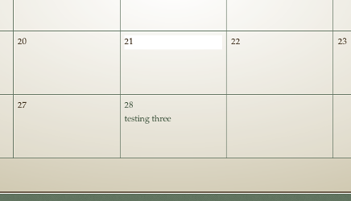

## you probably don't want to use this repo until this notice has been removed.

## Screenshot



Calendar screenshot showing event title as link to event page, when scheduled for a given date.

## License
No license was included with original code. Awaiting licensing details from upstream. Any changes made as of this repo are licensed AGPL.

## Installation

Install the package through [Composer](http://getcomposer.org/). Edit your project's `composer.json` file by adding:

```php
"ITwrx/calendar": "dev-master"
```
to your "require" block and
```php
"repositories": [
        {
            "type": "vcs",
            "url": "https://github.com/ITwrx/LaravelCalendar"
        }
    ]
```
as the last block.

Next, run the Composer update command from the Terminal:

    composer update

If you are using laravel 5.5.*, you are done installing. 

If you want to try this package with older versions of laravel you can add the service provider of the package and alias the package. To do this open your `config/app.php` file.

Add a new line to the `service providers` array:

	'ITwrx\Calendar\CalendarServiceProvider'

And finally add a new line to the `aliases` array:

	'Calendar' => 'ITwrx\Calendar\Facades\Calendar',


## Usage


You can use the `generate` method to generate a calendar.

```php
// Generate a calendar for the current month and year
Calendar::generate();

// Generate a calendar for the specified year and month
Calendar::generate(2012, 6);
```
If you want to add events you have two ways to do it:
The first way is to adding single events without attributes to the event's wrapper
```php
// Add an array of events as the third parameter to add them to the calendar, 
// keys should be the days of the month.
$data = array(
	3  => 'http://example.com/news/article/2006/03/',
	7  => 'http://example.com/news/article/2006/07/',
	13 => 'http://example.com/news/article/2006/13/',
	26 => 'http://example.com/news/article/2006/26/'
);

Calendar::generate(2006, 6, $data);
```
The second way is to adding multiple events in a same day.
You cal also add somre attributes to the event's wrapper
```php
// Add an array of events as the third parameter to add them to the calendar, 
// keys should be the days of the month.
$data = array();
$data[3][] = array(	
                'content' => 'http://example.com/news/article/2006/03/',
                'attr'    => array(
                        'class' => 'some-css-class'
                    )
                );
$data[3][] = array(
                'content' => 'http://example.com/news/article/2006/04/',
                'attr'    => array(
                        'class' => 'some-css-class'
                    )
                ),
$data[12][] = array(
                'content' => 'http://example.com/news/article/2006/10/',
                'attr'    => array(
                        'class' => 'another-css-class'
                    )
                ),

Calendar::generate(2006, 6, $data);
```

There are a few config variables you can set to change the layout of the calendar:

| Preference     | Default Value         | Options                                          | Description                                                                                                                         |
| -------------- | --------------------- | ------------------------------------------------ | ----------------------------------------------------------------------------------------------------------------------------------- |
| template       | None                  | None                                             | A string containing your calendar template. See the template section below.                                                         |
| local_time     | time()                | None                                             | A Unix timestamp corresponding to the current time.                                                                                 |
| start_day      | sunday                | Any week day (sunday, monday, tuesday, etc.)     | Sets the day of the week the calendar should start on.                                                                              |
| month_type     | long                  | long, short                                      | Determines what version of the month name to use in the header. long = January, short = Jan.                                        |
| day_type       | abr                   | long, short, abr                                 | Determines what version of the weekday names to use in the column headers. long = Sunday, short = Sun, abr = Su.                    |
| show_next_prev | false                 | true/false                                       | Determines whether to display links allowing you to toggle to next/previous months. See information on this feature below.          |
| segments       | false                 | true/false                                       | Default the next/prev link will use a query string, if you set this var to true, URI segments will be used                          |
| eventContainer | <p {attr}>{event}</p> | Some HTML containing {event} and optional {attr} | HTML DOM to show the event ({event} is the string with the event's description and {attr} are the attributes defined in data array) |

You can set these values using the `initialize` method

```php
$config = array(
	'start_day' => 'monday',
	'month_type' => 'long'
);

Calendar::initialize($config);
```

## Template

You can also change the template used for the calendar. 

```php
$template = '
   {table_open}<table border="0" cellpadding="0" cellspacing="0">{/table_open}

   {heading_row_start}<tr>{/heading_row_start}

   {heading_previous_cell}<th><a href="{previous_url}">&lt;&lt;</a></th>{/heading_previous_cell}
   {heading_title_cell}<th colspan="{colspan}">{heading}</th>{/heading_title_cell}
   {heading_next_cell}<th><a href="{next_url}">&gt;&gt;</a></th>{/heading_next_cell}

   {heading_row_end}</tr>{/heading_row_end}

   {week_row_start}<tr>{/week_row_start}
   {week_day_cell}<td>{week_day}</td>{/week_day_cell}
   {week_row_end}</tr>{/week_row_end}

   {cal_row_start}<tr>{/cal_row_start}
   {cal_cell_start}<td>{/cal_cell_start}

   {cal_cell_content}<a href="{content}">{day}</a>{/cal_cell_content}
   {cal_cell_content_today}<div class="highlight"><a href="{content}">{day}</a></div>{/cal_cell_content_today}

   {cal_cell_no_content}{day}{/cal_cell_no_content}
   {cal_cell_no_content_today}<div class="highlight">{day}</div>{/cal_cell_no_content_today}

   {cal_cell_blank}&nbsp;{/cal_cell_blank}

   {cal_cell_end}</td>{/cal_cell_end}
   {cal_row_end}</tr>{/cal_row_end}

   {table_close}</table>{/table_close}
';

Calendar::initialize(array('template' => $template));

echo Calendar::generate();
```
